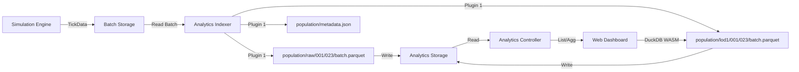

# Analytics Pipeline Proposal

**Status:** Draft
**Date:** 2025-11-28
**Author:** Assistant

## 1. Overview

This proposal defines the architecture for a scalable, plugin-based analytics system for Evochora. The goal is to generate scientific metrics from simulation runs (post-mortem or live) and visualize them in a web-based dashboard without burdening the simulation runtime or the core database.

The system leverages the existing data pipeline architecture, introducing a new `AnalyticsIndexer` service that reads raw simulation data from storage and produces query-optimized artifacts (e.g., Parquet files) and a unified manifest. These artifacts are served via HTTP to a browser-based client (DuckDB WASM) for visualization.

## 2. Requirements

### 2.1 Functional Requirements

*   **FR1 - Analytics Generation:** The system MUST be able to read simulation data (TickData batches) and compute defined metrics.
*   **FR2 - Plugin System:** The logic for computing metrics MUST be encapsulated in plugins. Adding a new metric (e.g., specific molecule distribution) MUST NOT require modifying the core service code.
*   **FR3 - Artifact Storage:** Metric results MUST be stored as persistent artifacts (files/blobs) in the storage layer.
*   **FR4 - Format:** The system MUST write analytical artifacts in **Apache Parquet** format. This columnar format enables high-performance queries directly from the browser (DuckDB WASM) and is optimal for cloud storage (S3).
*   **FR5 - Manifest Aggregation:** The system MUST provide a unified view of all available metrics (`manifest.json`) via the HTTP API. This aggregation MUST be dynamic or coordination-free to support competing consumers correctly.
*   **FR6 - Web Access:** The system MUST expose these artifacts and the manifest via a secure HTTP API to the frontend.
*   **FR7 - Initial Metric:** The system MUST implement one initial metric plugin: "Organism Count" (alive/dead over ticks).

### 2.2 Non-Functional Requirements

*   **NFR1 - Storage Abstraction:** Writing analytics artifacts MUST use a strictly typed abstraction (`IAnalyticsStorageWriter`) to support future backends (S3) without code changes.
*   **NFR2 - Performance:** Analytics generation MUST NOT degrade the performance of the running simulation (handled via ServiceManager/Node separation).
*   **NFR3 - Scalability:** The architecture MUST support competing consumers for parallel processing of analytics batches (if the output format supports it, e.g., one file per batch).
*   **NFR4 - Loose Coupling:** The HTTP Controller MUST be agnostic of the specific metrics. It serves files based on the storage interface, not hardcoded logic.
*   **NFR5 - Self-Describing UI:** The frontend visualization SHOULD be driven by the manifest configuration provided by the backend plugins, minimizing frontend code changes for new standard charts.
*   **NFR6 - Observability:** All components (Indexer, Storage Wrappers, Controller) MUST adhere to the project's monitoring and logging guidelines (O(1) metrics, structural logging).
*   **NFR7 - Quality Assurance:** Implementation MUST follow strict testing guidelines (Unit tests < 200ms, Integration tests, no Thread.sleep).
*   **NFR8 - Configurable Resolution:** To handle massive simulations (10^9 ticks), the system MUST support:
    *   **Sampling:** Configurable `samplingInterval` to process only every N-th tick.
    *   **LOD (Level of Detail):** Parallel generation of aggregated datasets (e.g. raw, 1/10, 1/100 resolution) for fast frontend overview.
    *   **Folder Structure:** Automatic hierarchical folder organization for output files to prevent filesystem limits (borrowed from PersistenceService).

## 3. Architecture Design

### 3.1 Data Flow



### 3.2 Parquet Generation & Buffering

To support **FR4 (Parquet Format)** while maintaining **NFR1 (Storage Abstraction)**, we utilize **DuckDB JDBC** for its high-performance, dependency-light Parquet generation capabilities.

**Why DuckDB?**
*   **No Heavy Dependencies:** Eliminates the need for Hadoop Common libraries.
*   **Performance:** Native C++ engine, highly optimized for columnar data.
*   **Compatibility:** Bundled native binaries for Windows, macOS, Linux (x64 & ARM64).

**Solution: Centralized Parquet Writer with Temp Files**

1.  **Plugins** request a writer via `context.createWriter(metricId, schema)`.
2.  **Infrastructure (AnalyticsIndexer)**:
    *   Creates an in-memory DuckDB connection (or temp-file DB for huge batches).
    *   Creates a table matching the schema.
    *   Inserts data via `PreparedStatement` batching.
    *   On `close()`, executes `COPY table TO 'temp_file.parquet' (FORMAT PARQUET)`.
    *   Streams the resulting Parquet file to `IAnalyticsStorageWrite`.
    *   **Cleanup:** Closes DuckDB connection and deletes temp file.

### 3.3 Thread Safety & Concurrency Model

*   **AnalyticsIndexer Service:**
    *   Runs in a single thread (like all `AbstractBatchIndexer` implementations).
    *   Plugins are instantiated per service instance -> **Plugins do not need to be thread-safe**.
    *   Components (`TickBufferingComponent`, `MetadataReadingComponent`) are private to the instance.
*   **Resources (`IAnalyticsStorageWrite`, `IAnalyticsStorageRead`):**
    *   Must be **Thread-Safe**. Multiple services (Indexer, Controller) access them concurrently.
    *   `FileSystemStorageResource` achieves this via stateless methods (paths derived from arguments) or synchronized blocks if state is needed.
*   **Competing Consumers:**
    *   Multiple `AnalyticsIndexer` instances can run in parallel (same consumer group).
    *   Coordination via `batch-topic` (partitioning).
    *   **Output Conflict Handling:**
        *   Parquet/CSV files must be unique per batch to avoid overwrite conflicts.
        *   Naming convention: `metric_name/batch_{startTick}_{endTick}.parquet`.
    *   **Manifest Handling:**
        *   NO central `manifest.json` written by Indexers (avoids race conditions).
        *   Instead, Indexers write small `metadata.json` files per metric/plugin once (idempotent write).
        *   The `AnalyticsController` aggregates these on-the-fly.

### 3.4 Error Handling Strategy

Follows the global pipeline standard (`AGENTS.md`) with added Bulkhead Pattern for plugins:

1.  **Transient Errors (Storage/IO):**
    *   If **ANY** plugin throws an `IOException` (e.g. S3 down), the **entire batch fails**.
    *   **Reason:** Data integrity. We don't want to skip data due to infrastructure issues.
    *   **Action:** Exception bubbles up -> **NO ACK** -> Redelivery. Plugins effectively retry on next delivery (idempotent overwrite).
2.  **Plugin Logic Errors (Bugs):**
    *   If a plugin throws a `RuntimeException` (e.g. NPE, parsing error), it is **caught and logged**.
    *   **Action:** `log.error("Plugin X failed for batch...", e)`.
    *   **Result:** Other plugins continue. The batch is **ACKed** (if IO was fine).
    *   **Trade-off:** Data gap for that specific metric/batch, but pipeline keeps running. Prevents experimental plugins from blocking core metrics.
3.  **Manifest Aggregation Errors:**
    *   Eliminated by design: Aggregation happens on Read (Controller), not Write (Indexer).
    *   If a `metadata.json` is missing or corrupt, that single metric is skipped in the dashboard, but others work.
    *   Implemented via `ConcurrentHashMap` with TTL (timestamp check).
    *   **Constraint:** No new dependencies (Caffeine/Guava) for this simple use case.
4.  **Idempotency (File Overwrite):**
    *   Since plugins write files based on batch range (deterministic filenames), re-processing a batch simply **overwrites** the existing file.
    *   **Safety:** Atomic write (write to temp -> move) ensures readers never see partial files.
    *   **No Append:** Plugins MUST write new files per batch. Appending to existing files is forbidden (incompatible with S3).

### 3.5 Interfaces & API Definitions

#### 3.5.1 Storage Capability Interfaces
These interfaces extend the storage layer capabilities without modifying existing Batch interfaces.

```java
package org.evochora.datapipeline.api.resources.storage;

import java.io.IOException;
import java.io.OutputStream;
import java.io.InputStream;
import java.util.List;

/**
 * Capability for writing generic analysis artifacts (blobs/files).
 * Used by Analytics Plugins to store results.
 * 
 * Implementations (wrappers) should handle monitoring (bytes written, latency).
 * 
 * <strong>Thread Safety:</strong> Implementations MUST be thread-safe.
 */
public interface IAnalyticsStorageWrite {
    /**
     * Opens an output stream to write an analysis artifact.
     * The implementation handles path resolution relative to its analytics root.
     * 
     * @param runId The simulation run ID (to separate artifacts by run)
     * @param metricId The metric/plugin identifier (e.g. "population")
     * @param lodLevel The LOD level ("raw", "lod1", etc.) or null for metadata
     * @param filename Filename (e.g. "batch_1000_2000.parquet")
     * @return Stream to write data to. Caller must close it.
     */
    OutputStream openAnalyticsOutputStream(String runId, String metricId, String lodLevel, String filename) throws IOException;
    
    /**
     * Writes a complete blob atomically (optional helper).
     */
    default void writeAnalyticsBlob(String runId, String metricId, String lodLevel, String filename, byte[] data) throws IOException { ... }
}

/**
 * Capability for reading generic analysis artifacts.
 * Used by AnalyticsController to serve files via HTTP.
 * 
 * Note: Typically used directly without wrapper monitoring, as HTTP layer 
 * handles metrics.
 * 
 * <strong>Thread Safety:</strong> Implementations MUST be thread-safe.
 */
public interface IAnalyticsStorageRead {
    /**
     * Opens an input stream to read an analysis artifact.
     * 
     * @param runId The simulation run ID
     * @param path Relative path (e.g. "population/stats_batch_001.csv")
     * @return Stream to read data from. Caller must close it.
     * @throws IOException If file not found or readable.
     */
    InputStream openAnalyticsInputStream(String runId, String path) throws IOException;
    
    /**
     * Lists all analytics artifacts matching a prefix.
     * 
     * @param runId The simulation run ID
     * @param prefix Path prefix (e.g. "population/") or empty for root.
     * @return List of relative paths.
     */
    List<String> listAnalyticsFiles(String runId, String prefix) throws IOException;
}
```

#### 3.5.2 Plugin API
The contract for all analytics modules.

```java
package org.evochora.analytics.api;

import com.typesafe.config.Config;
import org.evochora.datapipeline.api.contracts.TickData;
import org.evochora.datapipeline.api.contracts.SimulationMetadata;
import java.util.List;

/**
 * Interface for Analytics Plugins.
 * Instances are created per-service, so they do NOT need to be thread-safe.
 */
public interface IAnalyticsPlugin {
    /**
     * Configure the plugin from HOCON.
     * Must read: samplingInterval, lodFactor, lodLevels.
     */
    void configure(Config config);

    /**
     * Initialize plugin for a specific run.
     * Called once per run (or per service start).
     * 
     * @param context Provides access to writers and metadata.
     */
    void initialize(IAnalyticsContext context);

    /**
     * Process a batch of tick data.
     * Uses context to write data.
     */
    void processBatch(List<TickData> batch);

    void onFinish();
    ManifestEntry getManifestEntry();
}

/**
 * Context provided to plugins.
 * Abstracts away Parquet generation, temp file handling, and storage.
 */
public interface IAnalyticsContext {
    SimulationMetadata getMetadata();
    
    /**
     * Creates a writer for a specific metric.
     * Handles Parquet file creation, rotation, and temp file management.
     */
    IAnalyticsWriter createWriter(String metricId, Schema schema);
}

/**
 * Abstract Base Class for Plugins.
 * Simplifies LOD generation and configuration handling.
 * Subclasses only need to implement `processTick(TickData)` or `processBatch(List<TickData>)` for raw data.
 * The base class handles sampling, LOD aggregation, and file writing.
 */
public abstract class AbstractAnalyticsPlugin implements IAnalyticsPlugin {
    // ... standard implementation of lifecycle and LOD logic ...
}
```

// Data Transfer Object for Manifest
public class ManifestEntry {
    public String id;           // e.g. "population_stats"
    public String name;         // e.g. "Population Overview"
    public String description;
    
    // Map of LOD levels to source file patterns
    // Key: "raw", "lod1", "lod2"
    // Value: Glob pattern e.g. "population/lod1/batch_*.parquet"
    public Map<String, String> dataSources;
    
    public VisualizationHint visualization; // e.g. { type: "line-chart", x: "tick", y: "count" }
}
```

### 3.6 Configuration Design (`evochora.conf`)

#### 3.6.1 Storage Resource
We reuse `tick-storage` by adding capability interfaces to `FileSystemStorageResource`. No config change needed here, just implementation update.

```hocon
resources {
  tick-storage {
    className = "org.evochora.datapipeline.resources.storage.FileSystemStorageResource"
    options {
      rootDirectory = "${user.home}/evochora/data/storage"
      # Internally maps analytics to rootDirectory/analytics/runId/
    }
  }
}
```

#### 3.6.2 Analytics Indexer & Plugins
```hocon
services {
  analytics-indexer {
    className = "org.evochora.datapipeline.services.indexers.AnalyticsIndexer"
    resources {
      # Input
      storage = "storage-read:tick-storage"
      topic = "topic-read:batch-topic"
      metadata = "db-meta-read:index-database" # For reading env properties
      
      # Output (Capability Binding)
      analyticsOutput = "analytics-write:tick-storage" 
    }
    options {
      # Standard Indexer Options
      runId = ${?pipeline.runId}
      
      # Standard Batch Indexer Options
      metadataPollIntervalMs = 1000
      insertBatchSize = 1000
      flushTimeoutMs = 5000
      
      # Temp directory for Parquet generation (local disk)
      # Must have enough space for largest batch * num_plugins
      tempDirectory = "${java.io.tmpdir}/evochora/analytics-temp"
      
      # Plugin Configuration
      plugins = [
        {
          className = "org.evochora.analytics.plugins.PopulationMetricsPlugin"
          options {
            # Plugin-specific settings
            outputFormat = "parquet"
            outputPath = "population"
            
            # Sampling & LOD
            samplingInterval = 1    # Process every tick
            lodFactor = 10          # Aggregation factor (10 -> 100 -> 1000)
            lodLevels = 2           # Number of LOD levels (LOD1, LOD2)
          }
        }
      ]
    }
  }
}
```

#### 3.6.3 HTTP Server Injection
Generic resource binding to inject `IAnalyticsStorageRead` into `AnalyticsController`.

```hocon
node {
  processes {
    http {
      options {
        # Generic Resource Injection
        resourceBindings {
          "org.evochora.datapipeline.api.resources.database.IDatabaseReaderProvider" = "index-database"
          "org.evochora.datapipeline.api.resources.storage.IAnalyticsStorageRead" = "tick-storage"
        }
        
        routes {
          # ... existing routes ...
          
          # New Analytics API
          analyzer {
            "$static" = "web/analyzer"
            api {
              "$controller" {
                className = "org.evochora.node.processes.http.api.analytics.AnalyticsController"
                options {}
              }
            }
          }
        }
      }
    }
  }
}
```

## 4. Implementation Plan

The implementation follows a "Walking Skeleton" approach with clearly defined phases.

## 5. Impact Analysis & Modified Files

This section lists all existing files that will be modified during implementation, to ensure transparency and scope control.

### Phase 1: Storage Capabilities
*   `src/main/java/org/evochora/datapipeline/resources/storage/FileSystemStorageResource.java`: Implement new interfaces.
*   `src/main/java/org/evochora/datapipeline/resources/storage/AbstractBatchStorageResource.java`: Add wrapper factory logic.

### Phase 3: Metrics
*   `build.gradle.kts`: Add Parquet/Hadoop dependencies.

### Phase 4: Server Exposure
*   `src/main/java/org/evochora/node/processes/http/HttpServerProcess.java`: Implement generic `resourceBindings`.

### Phase 5: Config
*   `evochora.conf`: Add new services and resources.

### Phase 1: Storage Capabilities (Foundation)
*Goal: Enable reading/writing arbitrary analytics files via abstract interfaces.*

**Impacted Files:**
*   `NEW`: `src/main/java/org/evochora/datapipeline/api/resources/storage/IAnalyticsStorageWrite.java`
*   `NEW`: `src/main/java/org/evochora/datapipeline/api/resources/storage/IAnalyticsStorageRead.java`
*   `MOD`: `src/main/java/org/evochora/datapipeline/resources/storage/FileSystemStorageResource.java` (Implement interfaces)
*   `MOD`: `src/main/java/org/evochora/datapipeline/resources/storage/AbstractBatchStorageResource.java` (Add wrapper factory logic for analytics usage types)

1.  **Define Interfaces:** Create `IAnalyticsStorageWrite.java` and `IAnalyticsStorageRead.java`.
2.  **Implement FileSystem:**
    *   Update `FileSystemStorageResource` to implement both interfaces.
    *   **Refactoring:** Extract directory structure logic from `AbstractBatchStorageResource` to a reusable helper (`StorageStructureUtil`).
    *   Logic: Map `openAnalyticsOutputStream` to `{root}/{runId}/analytics/{metric}/{lod}/{structure}/{file}`.
    *   **Wrapper Logic:** Update `AbstractBatchStorageResource.getWrappedResource` to support `analytics-write` usage type, returning a `MonitoredAnalyticsStorageWriter`.
    *   **Compile Checkpoint:** Run `./gradlew compileJava`.
3.  **Verification (Unit Test):**
    *   Create `FileSystemStorageAnalyticsTest.java`.
    *   **Test Case 1:** Write a string to "test.txt" for a dummy runId via `openAnalyticsOutputStream`.
    *   **Test Case 2:** Read the file back via `openAnalyticsInputStream` and assert content matches.
    *   **Test Case 3:** List files via `listAnalyticsFiles` and assert "test.txt" is present.
    *   **Action:** Run `./gradlew test`.

### Phase 2: Core Analytics Service & Plugin System
*Goal: Establish the plugin host and the API contract.*

**Impacted Files:**
*   `NEW`: `src/main/java/org/evochora/analytics/api/IAnalyticsPlugin.java`
*   `NEW`: `src/main/java/org/evochora/analytics/api/AbstractAnalyticsPlugin.java`
*   `NEW`: `src/main/java/org/evochora/analytics/api/IAnalyticsContext.java`
*   `NEW`: `src/main/java/org/evochora/analytics/api/ManifestEntry.java`
*   `NEW`: `src/main/java/org/evochora/datapipeline/services/indexers/AnalyticsIndexer.java`

4.  **Define Plugin API:** Create `IAnalyticsPlugin`, `AbstractAnalyticsPlugin` (Skeleton), and `ManifestEntry`.
5.  **Create Service Skeleton:**
    *   Create `AnalyticsIndexer` extending `AbstractBatchIndexer`.
    *   Implement empty stubs for `createComponents()` and `processBatch()`.
    *   **Compile Checkpoint:** Run `./gradlew compileJava`.
6.  **Implement Plugin Loading:**
    *   Implement logic in `AnalyticsIndexer` constructor to read `plugins` config array.
    *   Instantiate plugins via reflection.
    *   Call `configure()` on each plugin.
    *   **Startup Cleanup:** Ensure `tempDirectory` is cleared on startup to remove stale files from crashes.
7.  **Implement Manifest Logic:**
    *   Implement `writePluginMetadata()`: Call `getManifestEntry()` on plugins and write distinct `metadata.json` files.
    *   Call this in constructor or first batch (idempotent overwrite is fine).
8.  **Verification (Integration Test):**
    *   Create `AnalyticsIndexerTest.java`.
    *   Create a `MockAnalyticsPlugin`.
    *   **Test Case:** Start Indexer.
    *   **Assert:** `metric_id/metadata.json` exists in storage.
    *   **Action:** Run `./gradlew test`.

### Phase 3: The First Metric (Population - Parquet)
*Goal: Implement business logic with production-grade output format.*

**Impacted Files:**
*   `MOD`: `build.gradle.kts` (Add DuckDB JDBC dependency)
*   `NEW`: `src/main/java/org/evochora/analytics/plugins/PopulationMetricsPlugin.java`

9.  **Add Dependencies:**
    *   Add `org.duckdb:duckdb_jdbc` to `build.gradle.kts`.
    *   **Compile Checkpoint:** Run `./gradlew compileJava`.
10. **Create PopulationPlugin:**
    *   Implement `AbstractAnalyticsPlugin` (extending base class).
    *   **Logic:** In `processBatch`, iterate `TickData`, sum `alive`/`dead` organisms, calc `avg(energy)`.
    *   **Output:** Use `createWriter` to write data. The underlying implementation uses DuckDB to generate Parquet.
    *   **Constraint:** One file per batch (e.g. `population/batch_1000_1500.parquet`), no append.
11. **Verification (Unit Test):**
    *   Create `PopulationPluginTest.java`.
    *   **Test Case:** Feed a list of `TickData`.
    *   **Assert:** Verify that `IAnalyticsStorageWrite` received a byte stream starting with `PAR1` (Parquet magic bytes).
    *   **Action:** Run `./gradlew test`.

### Phase 4: Server Exposure
*Goal: Make data accessible via HTTP.*

**Impacted Files:**
*   `MOD`: `src/main/java/org/evochora/node/processes/http/HttpServerProcess.java` (Generic Resource Injection)
*   `NEW`: `src/main/java/org/evochora/node/processes/http/api/analytics/AnalyticsController.java`

12. **Update HttpServerProcess:**
    *   Implement generic `resourceBindings` logic to inject resources by interface name.
    *   **Compile Checkpoint:** Run `./gradlew compileJava`.
13. **Create AnalyticsController:**
    *   Implement `AnalyticsController`.
    *   Inject `IAnalyticsStorageRead`.
    *   Implement `GET /analyzer/api/manifest`:
        *   Call `storage.listAnalyticsFiles(runId, "")`.
        *   Filter for `*/metadata.json`.
        *   Read and aggregate JSONs.
        *   Return merged `manifest.json`.
    *   Implement `GET /analyzer/api/files/{path}`.
    *   **Compile Checkpoint:** Run `./gradlew compileJava`.
14. **Verification (Integration Test):**
    *   Create `AnalyticsControllerTest.java`.
    *   **Test Case:** Mock Storage with 2 metrics (folders with metadata.json).
    *   **Assert:** `GET /analyzer/api/manifest` returns aggregated JSON with 2 entries.
    *   **Action:** Run `./gradlew test`.

### Phase 5: End-to-End Verification (Walking Skeleton)
*Goal: Verify the full chain.*

**Impacted Files:**
*   `MOD`: `evochora.conf` (Enable Indexer, Configure Plugins)

15. **Configuration:**
    *   Update `evochora.conf` to enable `analytics-indexer` and configure `http` bindings.
16. **Integration Test (Full Stack):**
    *   Create `AnalyticsEndToEndTest.java`.
    *   **Setup:** Start `Node` (starts all services).
    *   **Action:** Produce 10 ticks of data via `DummyProducer` or manual write to `tick-queue`.
    *   **Wait:** Wait for `AnalyticsIndexer` to process ticks (monitor logs or latch).
    *   **Assert 1:** `manifest.json` aggregation via API works.
    *   **Assert 2:** Parquet file exists in storage and is downloadable via API.
    *   **Action:** Run `./gradlew test`.

### Phase 6: Frontend Dashboard
*Goal: Visualize the data.*

**Impacted Files:**
*   `NEW`: `src/main/resources/web/analyzer/index.html`
*   `NEW`: `src/main/resources/web/analyzer/assets/duckdb-wasm.js`
*   `NEW`: `src/main/resources/web/analyzer/assets/dashboard.js`

17. **Add DuckDB WASM:**
    *   Add DuckDB WASM JS assets to `src/main/resources/web/analyzer/assets/`.
18. **Create Dashboard JS:**
    *   Implement `dashboard.js`.
    *   **Logic:** Fetch `manifest.json` -> Loop entries -> Fetch Parquet -> Render.
19. **Create Visualizations:**
    *   Implement `LineChart.js` widget.
20. **Integrate:**
    *   Create `index.html` in `web/analyzer/`.
21. **Verification (Manual):**
    *   Start Node (`./gradlew run --args="node run"`).
    *   Open `http://localhost:8081/analyzer/index.html`.
    *   Verify chart appears and shows data.

## 6. Development Guidelines

### 6.1 Monitoring & Metrics
*   **O(1) Recording:** All metric recording MUST use O(1) operations (atomic counters, sliding window structures). No lists or iteration in the hot path.
*   **Components to Monitor:**
    *   **AnalyticsIndexer:** Batches processed/s, Ticks processed/s, Plugin execution time.
    *   **AnalyticsStorageWriter:** Bytes written/s, Write latency (p50/p99), Error counts.
    *   **AnalyticsStorageReader:** Bytes read/s, Read latency.
*   **Tooling:** Use `utils.monitoring.SlidingWindowCounter` and `PercentileTracker`.

### 6.2 Logging
*   **Levels:**
    *   `INFO`: Lifecycle events (Indexer started, Manifest written).
    *   `WARN`: Transient errors (Storage write failed - retrying).
    *   `ERROR`: Fatal errors (Invalid config, Plugin crash).
    *   `DEBUG`: per-batch details (Batch 123-456 processed).
*   **Format:** Structured log messages with context (runId, pluginName).
*   **No Stack Traces:** Do not log full stack traces at ERROR level (framework handles this at DEBUG).

### 6.3 Testing Strategy
*   **Unit Tests:**
    *   Mock `IAnalyticsStorageWrite` to verify Plugin logic.
    *   Mock `TickData` input.
    *   Execution time < 200ms.
*   **Integration Tests:**
    *   Use `FileSystemStorageResource` (real I/O) with temporary directories (`@TempDir`).
    *   Spin up `AnalyticsController` with mocked Storage to test HTTP API.
    *   **No `Thread.sleep()`**: Use Awaitility for async conditions.
*   **End-to-End Tests:**
    *   "Walking Skeleton": Node + Indexer + Plugin + Storage + Controller.
    *   Produce data -> Wait for Manifest -> Download Result.
